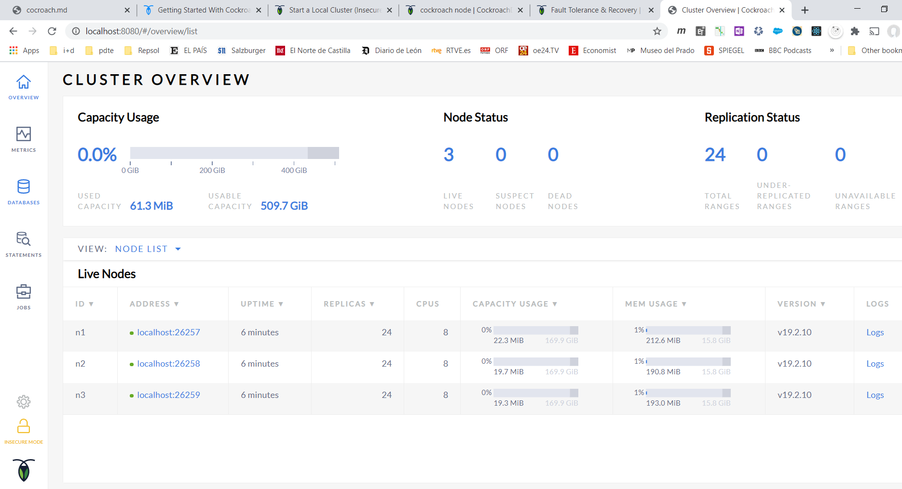

# Setup

Version de cocroach:

```ps
cockroach.exe version
```

Arranca cocroach:

```ps
cockroach.exe start-single-node --insecure --http-addr=localhost:8080 --listen-addr=localhost:26257
```

cockroach.exe start-single-node --insecure --http-addr=localhost:8080 --listen-addr=localhost:26257

# Consola

Crear una [workload](https://www.cockroachlabs.com/docs/stable/cockroach-workload.html) de prueba, en este caso `movr`:

```ps
cockroach workload init movr
```

Arrancar la consola SQL:

```ps
cockroach sql --insecure
```

Es equivalente a:

```ps
cockroach sql --insecure --host localhost:26257
```

Ver el contenido:

```ps
SHOW databases;

SHOW TABLES FROM movr;

SELECT * FROM movr.users LIMIT 10;
```

# Crear una base de datos, tabla, primary key

```ps
CREATE DATABASE crdb_uni;
```

Hacemos que la base de datos sea la base de datos por defecto:

```ps
SET database = crdb_uni;
```

Creamos una tabla. La tabla tiene una primary key de tipo `UUID`. Sino especificamos un valor al crear un registro, se asigna uno al azar:

```ps
CREATE TABLE students (id UUID PRIMARY KEY DEFAULT gen_random_uuid(), name STRING);
```

Podemos ver la definición de la tabla:

```ps
SHOW CREATE students;

  table_name |                create_statement
+------------+-------------------------------------------------+
  students   | CREATE TABLE students (
             |     id UUID NOT NULL DEFAULT gen_random_uuid(),
             |     name STRING NULL,
             |     CONSTRAINT "primary" PRIMARY KEY (id ASC),
             |     FAMILY "primary" (id, name)
             | )
(1 row)

Time: 7.3716ms
```

Vamos a crear otra tabla que tenga un primary key compuesto por más de una columna:

```ps
CREATE TABLE courses (sys_id UUID DEFAULT gen_random_uuid(), course_id INT, name STRING, PRIMARY KEY (sys_id, course_id));
```

Podemos modificar una tabla. Vamos a añadir una columna llamada `schedule`:

```ps
ALTER TABLE courses ADD COLUMN schedule STRING;

SHOW CREATE TABLE courses;

  table_name |                         create_statement
+------------+-------------------------------------------------------------------+
  courses    | CREATE TABLE courses (
             |     sys_id UUID NOT NULL DEFAULT gen_random_uuid(),
             |     course_id INT8 NOT NULL,
             |     name STRING NULL,
             |     schedule STRING NULL,
             |     CONSTRAINT "primary" PRIMARY KEY (sys_id ASC, course_id ASC),
             |     FAMILY "primary" (sys_id, course_id, name, schedule)
             | )
(1 row)

Time: 6.6662ms
```

```ps
CREATE TABLE products (id UUID PRIMARY KEY DEFAULT gen_random_uuid(), name STRING, quantity INT, price DECIMAL );

SHOW CREATE TABLE products;
```

# Cluster Concepts: The Keyspace, Ranges, and Replicas

Cocroach organiza la información en __Keyspaces__. El Keyspace es un conjunto de key-values con la primary key. Los Keyspaces a medida que van creación se van dividiendo en __ranges__. Un range tiene que ser mas pequeño que 64MB. Si el keyspace va creciendo de forma que un range supere los 64MB, Cocroach dividira el range en dos.

Cada range se replicará en un número impar de __replicas__. Las replicas son copias de un range.

El factor de replicación puede definirse/controlarse a nivel de cluster, base de datos y de tabla.

Para gestionar las replicas Cocroach utiliza [Raft](http://thesecretlivesofdata.com/raft/). Cada Rango tiene sus replicas en lo que se denomina un `Raft group`. En cada grupo tenemos un lider y varios seguidores.

Para la lectura Cockroach designa un __lease holder__ de entre las replicas, que tendrá como misión procesar todas las consultas. 

Para la escritura Cockroach usa Raft. En Raft todas las escrituras las procesa un nodo al que se ha designado como lider. El lider envia a los distintos followers las escrituras, y cuando recibe confirmación de una mayoría de los followers de que la escritura se ha hecho, se confirma al cliente que la escritura se ha completado y al __lease holder__ (el lease holder tiene que saber que escrituras se han confirmado por un consenso de los nodos, porque esta será la información que devuelva en caso de consulta. El lease holder es uno de los nodos del Raft group. Cocroach tratara siempre que sea posible que el lease hoder y el lider de Raft sean el mismo nodo. Podemos verlo con un ejemplo de [lecturas y escrituras](https://www.cockroachlabs.com/docs/stable/architecture/reads-and-writes-overview.html).

Cuando un cliente necesita hacer una lectura o una escritura puede contactar con cualquiera de los nodos del cluster. Tipicamente tendremos un balanceador que distribuira las peticiones de los clientes entre los nodos del cluster. El nodo que reciba la petición se denomina __gateway__. En el caso de una escritura, el gateway identificará cual es el nodo lider del Raft group, y reenviara la petición hacia ese nodo, iniciandose el proceso de log replication. Cuando el lider tenga confirmados los commits de una mayoría de los followers, respondera al gateway, y este al cliente. En caso de una lecutura el proceso es similar. En este caso no se lanza un proceso de replicación de logs, pero el gateway tiene que identificar quien es el lease holder de los datos, y __puede haber varios lease holders__ - habrá un solo lease holder por cada range, pero como podemos tener varios ranges, puede haber varios lease holders. Enviaría la petición a cada uno de ellos, y a medida que estos le vayan contestando, el gateway iría consolidando las respuestas. Cuando tenga todas las respuestas, el gateway contestará al cliente.

## Ejercicio

[Arrancamos](https://www.cockroachlabs.com/docs/stable/start-a-local-cluster.html) un cluster con tres nodos:

```ps
Start-Job -ScriptBlock {cockroach start --insecure --listen-addr=localhost:26257 --join="localhost:26257,localhost:26258,localhost:26259" --http-addr=localhost:8080 --store=cockroach-data-1}
  
Start-Job -ScriptBlock {cockroach start --insecure --listen-addr=localhost:26258 --join="localhost:26257,localhost:26258,localhost:26259" `
  --http-addr=localhost:8081 `
  --store=cockroach-data-2}
  
Start-Job -ScriptBlock {cockroach start --insecure --listen-addr=localhost:26259 --join="localhost:26257,localhost:26258,localhost:26259" `
--http-addr=localhost:8082 `
--store=cockroach-data-3}
```

En los parametros de arranque especificamos el puerto por el que cada nodo estara escuchando, `listen-addr`, - en nuestro caso como los ejecutaremos en la misma máquina, hemos puesto puertos diferentes. Tambien se indica mediante `join`, un conjunto de nodos que conforman el cluster. No hace falta especificar todos, pero por asociación, se terminarán descubriendo todos los nodos que conforman el cluster - whisper protocol. 

También se especifica la dirección en la que podremos encontrar la web de administración de cada nodo `http-addr`, y donde se guardaran los datos `store`.
Podemos ver el estado de los jobs:

```ps
Get-Job

Id     Name            PSJobTypeName   State         HasMoreData     Location             Command
--     ----            -------------   -----         -----------     --------             -------
11     Job11           BackgroundJob   Running       True            localhost            cockro...
13     Job13           BackgroundJob   Running       True            localhost            cockro...
15     Job15           BackgroundJob   Running       True            localhost            cockro...
```

Podemos ver la salida de los jobs:

```ps
PS [EUGENIO] >Receive-job 15
*
    + CategoryInfo          : NotSpecified: (*:String) [], RemoteException
    + FullyQualifiedErrorId : NativeCommandError
    + PSComputerName        : localhost

* WARNING: RUNNING IN INSECURE MODE!
*
* - Your cluster is open for any client that can access localhost.
* - Any user, even root, can log in without providing a password.
* - Any user, connecting as root, can read or write any data in your cluster.
* - There is no network encryption nor authentication, and thus no confidentiality.
*
* Check out how to secure your cluster:
https://www.cockroachlabs.com/docs/v19.2/secure-a-cluster.html
*
*
* INFO: initial startup completed.
* Node will now attempt to join a running cluster, or wait for `cockroach init`.
* Client connections will be accepted after this completes successfully.
* Check the log file(s) for progress.
*
```

Todabía no hemos inicializado el cluster. Esto tenemos que hacerlo la primera vez:

```ps
cockroach init --insecure --host=localhost:26257

Cluster successfully initialized
```

Ahora podemos ver el estado del cluster de cockroach en la página administrativa. La podemos abrir en la dirección especificada con el flag `--http-addr`. Por ejemplo en `http://localhost:8082`:



Podemos añadir más nodos al cluster:

```ps
Start-Job -ScriptBlock {cockroach start --insecure --listen-addr=localhost:26260 --join="localhost:26257,localhost:26258,localhost:26259" `
  --http-addr=localhost:8083 `
  --store=cockroach-data-4}
```

```ps
Start-Job -ScriptBlock {cockroach start --insecure --listen-addr=localhost:26261 --join="localhost:26257,localhost:26258,localhost:26259" `
  --http-addr=localhost:8084 `
  --store=cockroach-data-5}
```

Cuando tenemos un cluster con tres nodos, y el factor de replicación es tres, en cada nodo habrá una copia de un rango. Si un nodo muere, el cluster pasara a un estado inestable puesto que estamos por debajo del factor de replicación - el cluster sigue estando operativo porque tenemos aún suficientes nodos para mantener el quorum. Si el cluster tuviera más nodos Cockroach hara lo siguiente:

- Inicialmente la situación no será diferente de la del caso de tres nodos
- Cuando el cluster tiene solo tres nodos solo hay una cosa que pueda hacerse, salvo añadir un nuevo nodo. Sin embargo, si en el cluster hubiera más nodos, tras cinco minutos - valor por defecto -, el cluster dará por perdido el nodo, y como en el cluster tenemos otros nodos disponibles, Cockroach utilizara el resto de nodos del cluster para replicar en ellos los rangos que no tienen su cuota de replicas, de modo que al final del proceso la salud del cluster estará completamente restaurada

Que sucedería si antes de que transcurrieran esos cincon minutos otro nodo fallase. Ya no tendríamos el quuorum y el cluster ya no sería operativo ni para leer ni para escribir. Si queremos poder cubrir también este escenario tendríamos que incrementar el factor de replicación. Si el factor en lugar de ser tres fuera cinco, tendrían que fallar más de dos nodos para que no pudieramos tener quorum.

Podemos especificar el tiempo en el que el cluster considera que el nodo no volvera:

```ps
cockroach sql --insecure --host=localhost:26000 --execute="SET CLUSTER SETTING server.time_until_store_dead = '1m15s';"
```

# Secondary Indexes

[Indices](https://www.cockroachlabs.com/docs/stable/indexes.html)

## How do indexes work?
When you create an index, CockroachDB "indexes" the columns you specify, which creates a copy of the columns and then sorts their values (without sorting the values in the table itself).

After a column is indexed, SQL can easily filter its values using the index instead of scanning each row one-by-one. On large tables, this greatly reduces the number of rows SQL has to use, executing queries exponentially faster.

### Creation

__Each table automatically has an index created called primary__, which indexes either its primary key __or—if there is no primary key—a unique value for each row known as rowid__. We recommend always defining a primary key because the index it creates provides much better performance than letting CockroachDB use rowid.

The primary index helps filter a table's primary key but doesn't help SQL find values in any other columns. However, __you can use secondary indexes to improve the performance of queries using columns not in a table's primary key__. You can create them:

CockroachDB automatically creates secondary indexes for columns with the UNIQUE constraint.

### Selection

Because each query can use only a single index, CockroachDB selects the index it __calculates will scan the fewest rows (i.e., the fastest)__. To override CockroachDB's index selection, you can also force queries to use a specific index (also known as "index hinting"). __Index hinting__ is supported for SELECT, DELETE, and UPDATE statements.

## Ejercicio. Crear indices secundarios

Nos conectamos con la consola:

```ps
cockroach sql --insecure
```

Creamos la tabla con datos:

```ps
DROP TABLE IF EXISTS users;

CREATE TABLE users (id INT PRIMARY KEY,
                    last_name STRING NOT NULL,
                    first_name STRING NOT NULL,
                    country STRING,
                    city STRING);

INSERT INTO users (id, last_name, first_name, country, city)
     VALUES (1, 'Cross', 'William', 'USA', 'Jersey City'),
            (2, 'Seldess', 'Jesse', 'USA', 'New York'),
            (3, 'Hirata', 'Lauren', 'USA', 'New York'),
            (4, 'Cross', 'Zachary', 'USA', 'Seattle'),
            (5, 'Shakespeare', 'William', 'UK', 'Stratford-upon-Avon');		
```

Consultamos los datos:

```ps
SELECT * FROM users;

  id |  last_name  | first_name | country |        city
+----+-------------+------------+---------+---------------------+
   1 | Cross       | William    | USA     | Jersey City
   2 | Seldess     | Jesse      | USA     | New York
   3 | Hirata      | Lauren     | USA     | New York
   4 | Cross       | Zachary    | USA     | Seattle
   5 | Shakespeare | William    | UK      | Stratford-upon-Avon
(5 rows)

Time: 3.1951ms
```

Veamos los indices:

```ps
SHOW INDEXES FROM users;

  table_name | index_name | non_unique | seq_in_index | column_name | direction | storing | implicit
+------------+------------+------------+--------------+-------------+-----------+---------+----------+
  users      | primary    |   false    |            1 | id          | ASC       |  false  |  false  
(1 row)

Time: 6.0314ms
```

Si usamos el indice primario para buscar:

```ps
EXPLAIN SELECT * FROM users WHERE id = 1;

  tree |    field    |  description
+------+-------------+---------------+
       | distributed | false
       | vectorized  | false
  scan |             |
       | table       | users@primary
       | spans       | /1-/1/#
(5 rows)

Time: 3.3449ms
```

Ha usado el índice primario `users@primary`. No ha hecho una búsqueda distribuida.

Si usamos columnas que no son parte del índice primario, vemos que se sigue usando el primario:

```ps
EXPLAIN SELECT * FROM users WHERE last_name = 'Cross' AND first_name = 'William';

  tree |    field    |                    description
+------+-------------+----------------------------------------------------+
       | distributed | true
       | vectorized  | false
  scan |             |
       | table       | users@primary
       | spans       | ALL
       | filter      | (last_name = 'Cross') AND (first_name = 'William')
(6 rows)

Time: 1.2522ms
```

Creemos un indice secundario:

```ps
CREATE INDEX my_index ON users (last_name, first_name);
```

```ps
SHOW INDEXES FROM users;

  table_name | index_name | non_unique | seq_in_index | column_name | direction | storing | implicit
+------------+------------+------------+--------------+-------------+-----------+---------+----------+
  users      | primary    |   false    |            1 | id          | ASC       |  false  |  false  
  users      | my_index   |    true    |            1 | last_name   | ASC       |  false  |  false  
  users      | my_index   |    true    |            2 | first_name  | ASC       |  false  |  false  
  users      | my_index   |    true    |            3 | id          | ASC       |  false  |   true  
(4 rows)

Time: 6.5107ms
```

Repetimos la búsqueda, y vemos que ahora se usa el índice secundario:

```ps
EXPLAIN SELECT * FROM users WHERE last_name = 'Cross' AND first_name = 'William';

     tree    |    field    |                   description
+------------+-------------+-------------------------------------------------+
             | distributed | false
             | vectorized  | false
  index-join |             |
   ¦         | table       | users@primary
   +-- scan  |             |
             | table       | users@my_index
             | spans       | /"Cross"/"William"-/"Cross"/"William"/PrefixEnd
(7 rows)

Time: 4.5127ms
```

## Ejercicio. Uso de EXPLAIN

[SQL Tuning with EXPLAIN](https://www.cockroachlabs.com/docs/stable/sql-tuning-with-explain.html)

Usamos la base de datos `movr`:

```ps
cockroach demo movr
```

```ps
SELECT * FROM users WHERE name = 'Cheyenne Smith';

                   id                  | city  |      name      |      address      | credit_card
+--------------------------------------+-------+----------------+-------------------+-------------+
  e147ae14-7ae1-4800-8000-00000000002c | paris | Cheyenne Smith | 8550 Kelsey Flats | 4374468739
(1 row)

Time: 1.718ms
```

### Acceso por índice primario

```ps
EXPLAIN SELECT * FROM users WHERE name = 'Cheyenne Smith';

  tree |    field    |       description
+------+-------------+-------------------------+
       | distributed | true
       | vectorized  | false
  scan |             |
       | table       | users@primary
       | spans       | ALL
       | filter      | name = 'Cheyenne Smith'
(6 rows)

Time: 1.1907ms
```

Hace un `scan` de la tabla usando el índice primario `users@primary`:

```txt
| table       | users@primary
```

Es un full scan, esto es, se recorren todos los registros de la tabla:

```txt
| spans       | FULL SCAN
```

A medida que se recuperano los registros aplicamos un filtro:

```txt
| filter      | name = 'Cheyenne Smith'
```

### Acceso por índice secundario

Creamos un índice secundario:

```ps
CREATE INDEX on users (name);

SHOW INDEXES FROM users;

  table_name |   index_name   | non_unique | seq_in_index | column_name | direction | storing | implicit
+------------+----------------+------------+--------------+-------------+-----------+---------+----------+
  users      | primary        |   false    |            1 | city        | ASC       |  false  |  false
  users      | primary        |   false    |            2 | id          | ASC       |  false  |  false
  users      | users_name_idx |    true    |            1 | name        | ASC       |  false  |  false
  users      | users_name_idx |    true    |            2 | city        | ASC       |  false  |   true
  users      | users_name_idx |    true    |            3 | id          | ASC       |  false  |   true
(5 rows)

Time: 2.7017ms
```

Repetimos el EXPLAIN:

```txt
EXPLAIN SELECT * FROM users WHERE name = 'Cheyenne Smith';

     tree    |    field    |                  description
+------------+-------------+-----------------------------------------------+
             | distributed | false
             | vectorized  | false
  index-join |             |
   ¦         | table       | users@primary
   +-- scan  |             |
             | table       | users@users_name_idx
             | spans       | /"Cheyenne Smith"-/"Cheyenne Smith"/PrefixEnd
(7 rows)

Time: 1.9876ms
```

Ahora usamos el índice secundario. El índice secundario ordena por `name`, así qeu podemos localizar los registros que nos interesan usando solamente el índice. 

```txt
+-- scan  |             |
		 | table       | users@users_name_idx
		 | spans       | /"Cheyenne Smith"-/"Cheyenne Smith"/PrefixEnd
```

Como los datos que tenemos que recuperar no son exclusivamente los del índice, para cada dato que identifiquemos tenemos que acceder a la tabla para recuperar los datos que nos faltan. __Cockroach guarda siempre con los índices secundarios el índice primario__, de modo que acceder al resto de los datos se hace usando el índice primario.

```txt
  index-join |             |
   ¦         | table       | users@primary
   +-- scan  |             |
```

Los índices y los datos se guardan en rangos que no pueden superar los 64MB. El leaseholder guardara todos estos datos para servir consultas.

### Extender el índice secundario

Modificar el índice secundario

Vamos a modificar la query anterior para recuperar el `credit_card`

```ps
SELECT name, credit_card FROM users WHERE name = 'Cheyenne Smith';

       name      | credit_card
+----------------+-------------+
  Cheyenne Smith | 4374468739
(1 row)

Time: 2.5869ms
```

El acceso sigue el mismo path:

```ps
EXPLAIN SELECT name, credit_card FROM users WHERE name = 'Cheyenne Smith';

     tree    |    field    |                  description
+------------+-------------+-----------------------------------------------+
             | distributed | false
             | vectorized  | false
  index-join |             |
   ¦         | table       | users@primary
   +-- scan  |             |
             | table       | users@users_name_idx
             | spans       | /"Cheyenne Smith"-/"Cheyenne Smith"/PrefixEnd
(7 rows)

Time: 1.1756ms
```

Acceso al índice secundario, y una vez filtrados los datos, usa el índice primario para recuperar el `credit_card`. Vamos a modificar el índice para que se almacene con el índice el `credit_card`:

```ps
DROP INDEX users_name_idx;

CREATE INDEX ON users (name) STORING (credit_card);
```

Repetimos el EXPLAIN:

```ps
EXPLAIN SELECT name, credit_card FROM users WHERE name = 'Cheyenne Smith';

 tree |    field    |                  description
+------+-------------+-----------------------------------------------+
       | distributed | false
       | vectorized  | false
  scan |             |
       | table       | users@users_name_idx
       | spans       | /"Cheyenne Smith"-/"Cheyenne Smith"/PrefixEnd
(5 rows)

Time: 1.3745ms
```

Ahora observamos que se utiliza únicamente el índice secundatio para hacer el acceso.

### Joins

Volvemos a las condiciones iniciales del ejercicio:

```ps
DROP INDEX users_name_idx;
```

Hacemos un join de dos tablas por id:

```ps
SELECT count(DISTINCT users.id) FROM users INNER JOIN rides ON rides.rider_id = users.id WHERE start_time BETWEEN '2018-12-20 00:00:00' AND '2018-12-21 00:00:00';
```

El EXPLAIN:

```ps
EXPLAIN SELECT count(DISTINCT users.id) FROM users INNER JOIN rides ON rides.rider_id = users.id WHERE start_time BETWEEN '2018-07-20 00:00:00' AND '2018-07-21 00:00:00';

         tree         |    field    |                                         description           
+---------------------+-------------+---------------------------------------------------------------------------------------------+
                      | distributed | true                                                          
                      | vectorized  | false                                                         
  group               |             |                                                               
   ¦                  | aggregate 0 | count(DISTINCT id)                                            
   ¦                  | scalar      |                                                               
   +-- render         |             |                                                               
        +-- hash-join |             |                                                               
             ¦        | type        | inner                                                         
             ¦        | equality    | (rider_id) = (id)                                             
             +-- scan |             |                                                               
             ¦        | table       | rides@primary                                                 
             ¦        | spans       | ALL                                                           
             ¦        | filter      | (start_time >= '2018-07-20 00:00:00+00:00') AND (start_time <= '2018-07-21 00:00:00+00:00')
             +-- scan |             |                                                               
                      | table       | users@primary                                                 
                      | spans       | ALL  
```

Hace un scan del índice primario de la tabla rides, filtrando por `start_time`, y luego hace un scan en el índice primario de users buscando los que tengan los `rider_id` que nos interese. Si creamos un índice secundario que tenga el `start_time` y el `rider_id` podremos mejorar el acceso:

```ps
CREATE INDEX ON rides (start_time) STORING (rider_id);
```

```ps
EXPLAIN SELECT count(DISTINCT users.id) FROM users INNER JOIN rides ON rides.rider_id = users.id WHERE start_time BETWEEN '2018-12-20 00:00:00' AND '2018-12-21 00:00:00';

         tree         |    field    |                      description
+---------------------+-------------+-------------------------------------------------------+
                      | distributed | true
                      | vectorized  | false
  group               |             |
   ¦                  | aggregate 0 | count(DISTINCT id)
   ¦                  | scalar      |
   +-- render         |             |
        +-- hash-join |             |
             ¦        | type        | inner
             ¦        | equality    | (id) = (rider_id)
             +-- scan |             |
             ¦        | table       | users@primary
             ¦        | spans       | ALL
             +-- scan |             |
                      | table       | rides@rides_start_time_idx
                      | spans       | /2018-12-20T00:00:00Z-/2018-12-21T00:00:00.000000001Z
(15 rows)

Time: 2.2374ms
```

Ahora usamos el índice secundario y la query es más rápida.

### Join algorithms

CockroachDB supports the following algorithms for performing a join:

- Merge joins
- Hash joins
- Lookup joins

#### Merge joins

To perform a merge join of two tables, __both tables must be indexed on the equality columns__, and any __indexes must have the same ordering__. Merge joins offer better computational performance and more efficient memory usage than hash joins. When tables and indexes are ordered for a merge, CockroachDB chooses to use merge joins over hash joins, by default. When merge conditions are not met, CockroachDB resorts to the slower hash joins. Merge joins can be used only with distributed query processing.

Merge joins are performed on the indexed columns of two tables as follows:

- CockroachDB checks for indexes on the equality columns and that they are ordered the same (i.e., ASC or DESC).
- CockroachDB takes one row from each table and compares them.
	- For inner joins:
		- If the rows are equal, CockroachDB returns the rows.
		- If there are multiple matches, the cartesian product of the matches is returned.
		- If the rows are not equal, CockroachDB discards the lower-value row and repeats the process with the next row until all rows are processed.
	- For outer joins:
		- If the rows are equal, CockroachDB returns the rows.
		- If there are multiple matches, the cartesian product of the matches is returned.
		- If the rows are not equal, CockroachDB returns NULL for the non-matching column and repeats the process with the next row until all rows are processed.

#### Hash joins

If a merge join cannot be used, CockroachDB uses a hash join. Hash joins are computationally expensive and require additional memory.

Hash joins are performed on two tables as follows:

- CockroachDB __reads both tables and attempts to pick the smaller table__.
- CockroachDB __creates an in-memory hash table on the smaller table__. If the hash table is too large, it will spill over to disk storage (which could affect performance).
- CockroachDB then __scans the large table__, looking up each row in the hash table.

#### Lookup joins

The cost-based optimizer decides when it would be beneficial to use a lookup join. Lookup joins are used when __there is a large imbalance in size between the two tables__, as it only __reads the smaller table and then looks up matches in the larger table__. A lookup join requires that the right-hand (i.e., larger) table is indexed on the equality column.

Lookup joins are performed on two tables as follows:

- CockroachDB reads each row in the small table.
- CockroachDB then scans (or "looks up") the larger table for matches to the smaller table and outputs the matching rows.

You can override the use of lookup joins using join hints.

# Transacciones

Creamos la base de datos:

```ps
CREATE DATABASE bank;

set database=bank;

CREATE TABLE bank.customers (
    customer_id INT8 PRIMARY KEY, name STRING, address STRING
);

INSERT INTO bank.customers
VALUES (1, 'Petee', '101 5th Ave, New York, NY 10003'),
       (2, 'Carl', NULL),
       (3, 'Lola', NULL),
       (
        4,
        'Ernie',
        '1600 Pennsylvania Ave NW, Washington, DC 20500'
       );

CREATE TABLE bank.accounts (
    type        STRING,
    balance     DECIMAL(8,2),
    customer_id INT8 REFERENCES bank.customers (customer_id)
);

INSERT INTO bank.accounts
VALUES ('checking', 0.00, 1),
       ('checking', 250.00, 2),
       ('savings', 314.15, 2),
       ('savings', 42000.00, 4);
```

Ejemplo de commit:

```ps
SHOW TABLES FROM bank;

SELECT * FROM bank.customers;

SELECT * FROM bank.accounts;

SELECT balance >= 50 FROM bank.accounts WHERE type = 'checking' AND customer_id = 2;

UPDATE bank.accounts SET balance = balance - 50 WHERE type = 'checking' AND customer_id = 2;

SELECT * FROM bank.accounts WHERE type = 'checking' AND customer_id = 2;

BEGIN;
SELECT balance >= 200 FROM bank.accounts WHERE type = 'checking' AND customer_id = 2;
UPDATE bank.accounts SET balance = balance - 200 WHERE type = 'checking' AND customer_id = 2;
COMMIT;
```

Ejemplo de rollback:

```ps
BEGIN;

SELECT balance >= 200 FROM bank.accounts WHERE type = 'checking' AND customer_id = 2;
UPDATE bank.accounts SET balance = balance - 200 WHERE type = 'checking' AND customer_id = 2;

ROLLBACK;

SELECT * FROM bank.accounts WHERE type = 'checking' AND customer_id=2;
```

# Region

Al arrancar un nodo podemos especificar la localización del nodo:

```ps
cockroach start --insecure --locality=country=us,region=us-east --store=node1 --listen-addr=localhost:26257 --http-addr=localhost:8080 --join=localhost:26257,localhost:26258,localhost:26259
```

## Geo Partitioning

Podemos [particionar las tablas](https://www.cockroachlabs.com/docs/stable/partitioning.html) usando la localización. Esta es una feature disponible solo con la licencia entreprise:

```ps
SHOW RANGES FROM TABLE movr.vehicles;

ALTER TABLE movr.vehicles
PARTITION BY LIST (city) (
    PARTITION new_york VALUES IN ('new york'),
    PARTITION boston VALUES IN ('boston'),
    PARTITION washington_dc VALUES IN ('washington dc'),
    PARTITION seattle VALUES IN ('seattle'),
    PARTITION san_francisco VALUES IN ('san francisco'),
    PARTITION los_angeles VALUES IN ('los angeles')
);

ALTER PARTITION new_york OF TABLE movr.vehicles
CONFIGURE ZONE USING constraints='[+region=us-east]';

ALTER PARTITION boston OF TABLE movr.vehicles
CONFIGURE ZONE USING constraints='[+region=us-east]';

ALTER PARTITION washington_dc OF TABLE movr.vehicles
CONFIGURE ZONE USING constraints='[+region=us-central]';

ALTER PARTITION seattle OF TABLE movr.vehicles
CONFIGURE ZONE USING constraints='[+region=us-west]';

ALTER PARTITION san_francisco OF TABLE movr.vehicles
CONFIGURE ZONE USING constraints='[+region=us-west]';

ALTER PARTITION los_angeles OF TABLE movr.vehicles
CONFIGURE ZONE USING constraints='[+region=us-west]';

SELECT start_key, end_key, lease_holder_locality, replicas, replica_localities FROM [SHOW RANGES FROM TABLE movr.vehicles]
WHERE "start_key" NOT LIKE '%Prefix%' AND "end_key" NOT LIKE '%Prefix';
```
